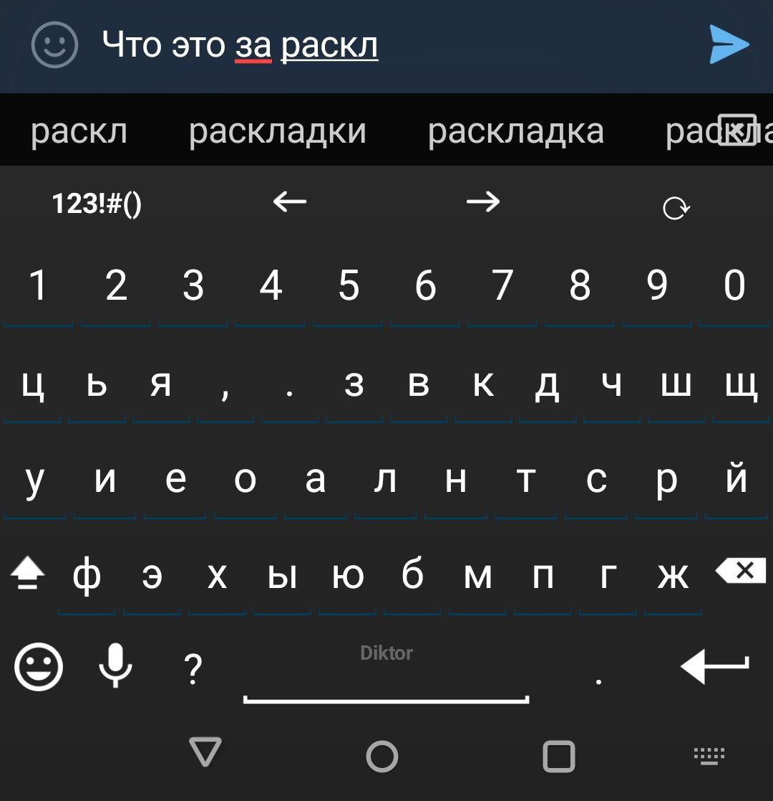

## Diktor for AnySoftKeyboard

Unofficial fork of AnySoftKeyboard/LanguagePack focused on one add‑on: Diktor (Russian) layouts.
Build is modernized; only Diktor participates in Gradle includes. License: Apache‑2.0.

Links:
- AnySoftKeyboard (engine): https://github.com/AnySoftKeyboard/AnySoftKeyboard
- Upstream (historical mono‑repo): https://github.com/AnySoftKeyboard/LanguagePack

### What is Diktor?

Google + check this one out as well https://github.com/mshkrebtan/diktor?tab=readme-ov-file


Diktor is a Russian keyboard layout family optimized for fast, ergonomic typing. 

Made this keyboard for Android because there was none.



This pack ships four variants:

- Diktor (base)
- Diktor compact
- Diktor tall + numbers row
- Diktor normal + numbers row

Common features:
- Top control row with arrows and quick layout switch inside alphabet mode
- “?” key left of space with rich popups; curated symbol popups on letters
- Stable control labels; arrows repeat on long press


It is recommended to disable animations because they are annoying when pressing keys:


---

## Download & install

Recommended: install AnySoftKeyboard (ASK for short) from F‑Droid, then install this Diktor add‑on APK from GitHub Releases.

1) Install ASK engine
- F‑Droid: https://f-droid.org/packages/com.menny.android.anysoftkeyboard/
- Play Store: https://play.google.com/store/apps/details?id=com.menny.android.anysoftkeyboard (F‑Droid is preferred for faster updates)

2) Install Diktor add‑on
- Download the latest signed APK from this repo’s Releases
- Open it on your device and confirm installation (enable “Unknown sources” if prompted)

3) Enable in ASK
- ASK Settings → Languages → Enable “Diktor …” keyboards you want
- Optional: disable key‑press animations in ASK Settings → UI → Animations (for snappier feel)

Troubleshooting
- “App not installed / Conflicting signatures”: remove any previously installed Diktor add‑ons with the same package name before installing. If needed, uninstall via ADB: `adb uninstall com.anysoftkeyboard.languagepack.diktor` or find it in settings in apps list.

---

## Build locally

Debug:
```
./gradlew :languages:diktor:apk:assembleDebug
```
Release (signed via env + /tmp keystore):
```
cp /path/to/diktor-release.keystore /tmp/add_on_pack.keystore
export PACKS_ALL_KEY_STORE_FILE_PASSWORD='••••'
export PACKS_ALL_KEY_STORE_FILE_DEFAULT_ALIAS='diktor'
export PACKS_ALL_KEY_STORE_FILE_DEFAULT_ALIAS_PASSWORD='••••'
./gradlew :languages:diktor:apk:assembleRelease
```
Artifacts are copied to `add_ons_apks/debug|release/`.

---

## FAQ (short)
- Where to get ASK? Prefer F‑Droid; Play is OK but updates lag.
- How to switch variants? ASK Settings → Languages → Keyboard selection; use the top‑row cycle key to switch between Diktor variants.
- Is this a standalone app? No, it’s an add‑on APK for AnySoftKeyboard.

---

## Credits & License
- Original work by AnySoftKeyboard contributors. This fork: Diktor layouts + build modernization.
- License: Apache‑2.0

```
Licensed under the Apache License, Version 2.0 (the "License");
you may not use this file except in compliance with the License.
You may obtain a copy of the License at

http://www.apache.org/licenses/LICENSE-2.0

Unless required by applicable law or agreed to in writing, software
distributed under the License is distributed on an "AS IS" BASIS,
WITHOUT WARRANTIES OR CONDITIONS OF ANY KIND, either express or implied.
See the License for the specific language governing permissions and
limitations under the License.
```
