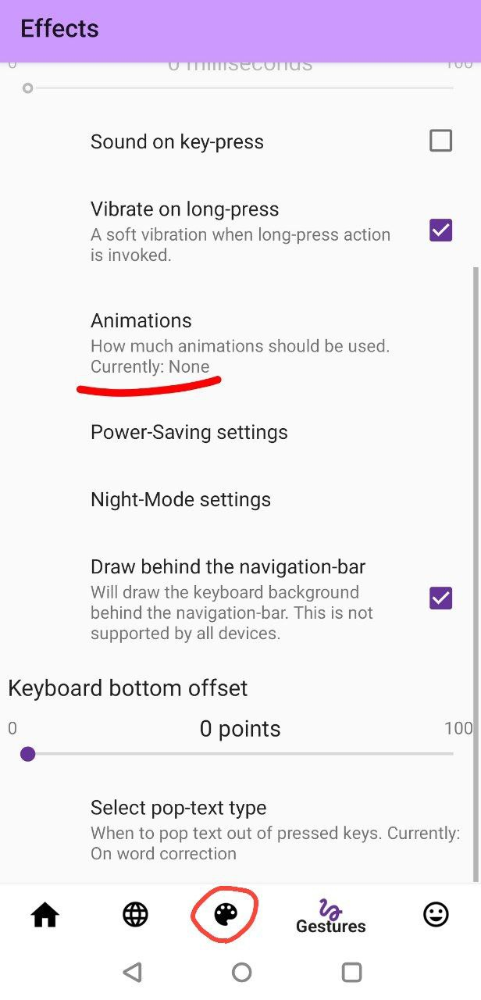

### What is this?

an APK addon for AnySoftKeyboard - Russian Diktor keyboard for Android  

### What is Diktor?

Google + check this one out as well https://github.com/mshkrebtan/diktor?tab=readme-ov-file
<!-- 
<p align="center">
	
  
</p> -->

Diktor is a Russian keyboard layout family optimized for fast, ergonomic typing like Dvorak. 

Made this keyboard for Android because there was none.
<p align="center">
	
</p>

## Download & install

Recommended: install AnySoftKeyboard (ASK for short) from F‑Droid, then install this Diktor add‑on APK from GitHub Releases.

1) Install ASK engine
- F‑Droid: https://f-droid.org/packages/com.menny.android.anysoftkeyboard/
- Play Store: https://play.google.com/store/apps/details?id=com.menny.android.anysoftkeyboard (F‑Droid is preferred)

2) Install Diktor add‑on
- Download the latest signed APK from this repo’s Releases: https://github.com/james19hadley/LanguagePack-Diktor/releases
- Open it on your device and confirm installation (enable “Unknown sources” if prompted)

3) Enable in ASK
- ASK Settings → Languages → Enable “Diktor …” keyboards you want
- Optional: disable key‑press animations in ASK Settings → UI → Animations (for snappier feel)

Troubleshooting
- “App not installed / Conflicting signatures”: remove any previously installed Diktor add‑ons with the same package name before installing. If needed, uninstall via ADB: `adb uninstall com.anysoftkeyboard.languagepack.diktor` or find it in settings in apps list.

---

## Diktor for AnySoftKeyboard

Unofficial fork of AnySoftKeyboard/LanguagePack focused on one add‑on: Diktor (Russian) layouts.

Build is modernized; 

only Diktor participates in Gradle includes.

Links:
- AnySoftKeyboard (engine): https://github.com/AnySoftKeyboard/AnySoftKeyboard
- Upstream (historical mono‑repo): https://github.com/AnySoftKeyboard/LanguagePack


This pack ships four variants:</strong></p>
<ul>
    <li>Diktor (base)</li>
    <li>Diktor compact</li>
    <li>Diktor tall + numbers row</li>
    <li>Diktor normal + numbers row</li>
</ul>

<p>It is recommended to disable animations because they are annoying when pressing keys.</p>
<div style="display: flex; gap: 16px;">
    
    
</div>

<p><strong>Common features:</strong></p>
<ul>
    <li>Top control row with arrows and quick layout switch inside alphabet mode</li>
    <li>“?” key left of space with rich popups; curated symbol popups on letters</li>
    <li>Stable control labels; arrows repeat on long press</li>
	<li>Btw you can change language by swiping on the space bar sideways</li>
</ul>

---

## Build locally

Debug:
```
./gradlew :languages:diktor:apk:assembleDebug
```
Release (signed via env + /tmp keystore):
```
cp /path/to/diktor-release.keystore /tmp/add_on_pack.keystore
export PACKS_ALL_KEY_STORE_FILE_PASSWORD='••••'
export PACKS_ALL_KEY_STORE_FILE_DEFAULT_ALIAS='diktor'
export PACKS_ALL_KEY_STORE_FILE_DEFAULT_ALIAS_PASSWORD='••••'
./gradlew :languages:diktor:apk:assembleRelease
```
Artifacts are copied to `add_ons_apks/debug|release/`.

---

## Credits & License
- Original work by AnySoftKeyboard contributors. This fork: Diktor layouts + build modernization.
- License: Apache‑2.0
- This was vibe coded so its AI slop but hey it works haha

---

### По‑русски (кратко)
Diktor, Диктор — русская раскладка клавиатуры для AnySoftKeyboard на Android. Это аддон (APK) с несколькими вариантами: базовая, компактная и с цифровым рядом. Поддерживает навигационные стрелки, быстрый переключатель раскладок и расширенные поп‑апы символов. Скачать APK можно в разделе Releases; работает с AnySoftKeyboard из F‑Droid или Google Play.


### Keywords 
(EN)
AnySoftKeyboard, Diktor keyboard layout, Russian keyboard for Android, Android keyboard addon APK, Diktor APK, number row, navigation arrows, symbol popups, compact keyboard layout.

(RU): раскладка клавиатуры Диктор, русская клавиатура Android, AnySoftKeyboard аддон, Diktor APK, альтернативная клавиатура, клавиатура с цифровым рядом.
